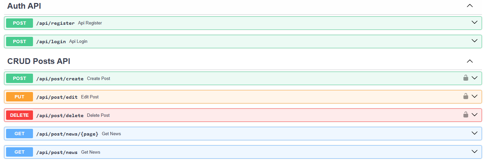

# Social-Network-API
>REST API простой социальной сети с возможностью аутенфикации и CRUD постов.

## Тех. стек: 
- FastAPI
- sqlite3
- token based auth (JWT)
- argon2 (password hash)

## Функциональность
- Создание постов
- Редактирование постов (только автор)
- Удаление постов (только автор)
- Просмотр ленты новостей с пагинацией

## Endpoints
### **Auth**
1. POST `/api/register/` - регистрация
2. POST `/api/login/` - вход

### **Posts CRUD**
1. POST `/api/post/create` - создание поста
2. PUT `/api/post/edit` - редактирование существующего поста
3. DELETE `/api/post/delete` - удаление поста по id
4. GET `/api/post/news` - получение новых постов
5. GET `/api/post/news/{page}` - получение новых постов с пагинацией, например page=1 - 1 страница (10 постов), page=2 - 2 страница

##

##
